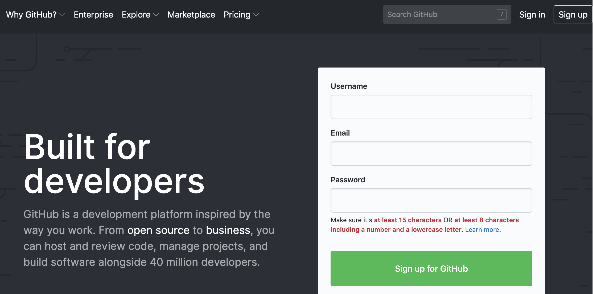
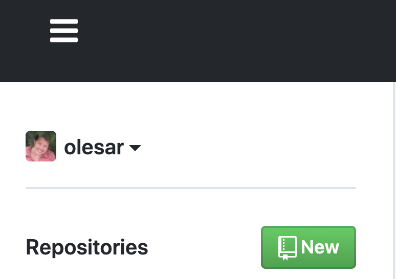
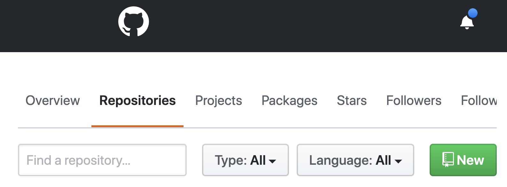
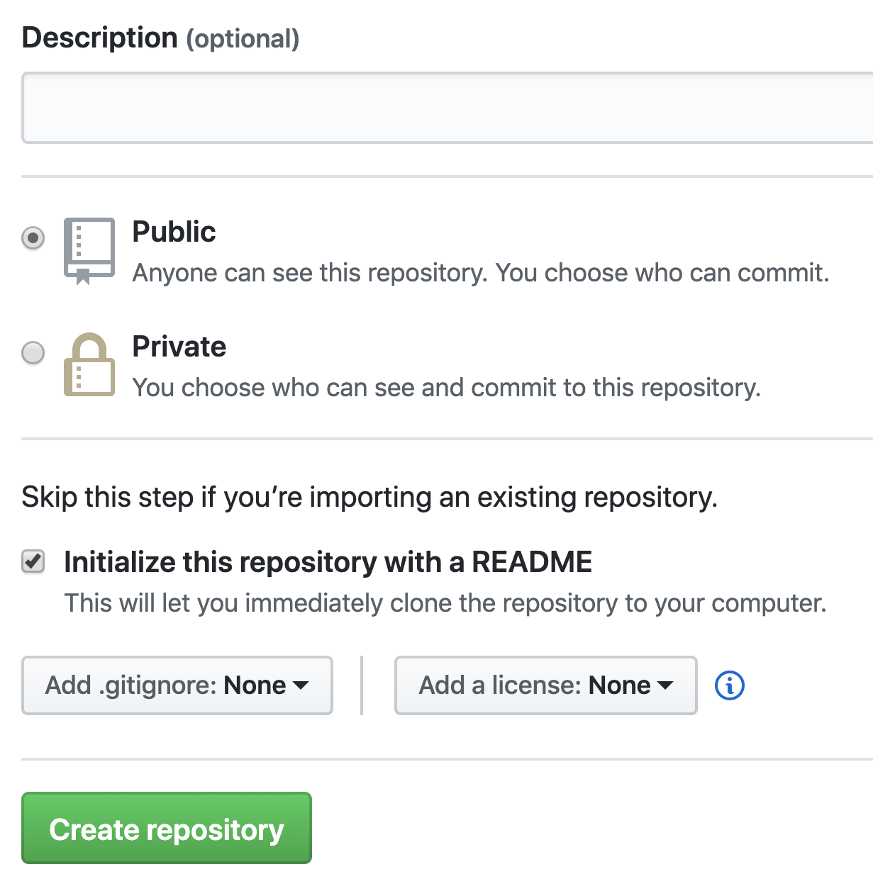

# Личная страничка в HTML

Создайте свою личную страницу с именем, фотографией и сведениями о вас. 

Возможно несколько вариантов выполнения задания. Если вы имеете опыт в создании страниц и сайтов, вы можете загрузить свой вариант, сделанный вами "с нуля". 
Во втором случае, вы можете взять [этот файл](https://raw.githubusercontent.com/olesar/lingdata/gh-pages/data/example-webpage.html) как образец, 
разобраться в структуре приведенного примера, исправить ошибку в расположении тегов <i> и <b>, вписать собственную информацию вместо той, что находится в образце, 
в случае необходимости поменяв порядок блоков html-кода или продублировав блоки. 

## Порядок действий

* сохраните страницу под именем **index.html** (такое имя файла очень важно). Советуем редактировать файл в NotePad++ и его аналогах, где вы будете лучше видеть теги. Кодировка файла - UTF8.  

* не забудьте разместить на сайте свою веселую **фотографию-портрет**. Лицо должно занимать половину или две трети изображения по высоте. Лучше избегать фотографий в стиле "я со спины", "пол-лица закрывает роскошная шляпа"; публиковать фотографии котиков (вместо себя) - тоже не лучшее решение, так никто из преподавателей не сможет вас опознать:) 
Файл с фотографией желательно перевести в формат jpg. Страница должна содержать гиперссылку на этот файл. Нежелательно ссылаться на внешние ресурсы в сети, где лежит фотография, так как в будущем ваша ссылка легко может оказаться "битой".
Если фотография отображается в слишком большом размере или искажена по высоте/ширине, измените атрибуты height и width в теге.

* проверьте, что страница читается в браузере, а фотография видна. 

* Создайте на GitHub репозиторий **mywebpage** и положите в него файл **index.html**, а также файл с фотографией и другие необходимые файлы, если нужно.  

**Дополнительные опции, которые не влияют на оценку**

* Если вы уже хорошо знаете HTML (и CSS), при желании можете показать свои умения, улучшив внешний вид страницы за счет форматирования. Лучших веб-мастеров мы потом попросим сделать общую страницу для вашей группы, с фотографиями всех студентов.

## Критерии оценивания

* страница имеет корректную стуктуру, вложенность тегов не нарушена   

* содержание страницы -- напишите про себя что-то интересное и нетривиальное

* вы умеете пользоваться тегом href - фотография отображается корректно и в разумном размере

* вы умеете пользоваться хотя бы элементарными средствами визуального выделения и увеличения/уменьшения текста (например, курсивом, размером шрифта)  

* дизайн страницы умеренный, не "кричащий". Рекомендуется использовать не более трех-четырех цветов в оформлении страницы.

## Частые ошибки начинающих веб-мастеров
### URL-ссылки ведут на файл, лежащий в домашнем компьютере
Пример: \. В этом случае фотография будет отображаться, только если вы откроете html-страничку тоже на домашнем компьютере, а не в Интернете.
Решение: Положите файл с фотографией на сервер (в папку репозитория GitHub).

### Страница загружается очень медленно
Если ваши фотографии очень "тяжелые" (например, файл весит 500 Мб), то страница будет загружаться медленно. Уменьшите размер исходного файла. 

### Не отображается часть текста, оформление текста
Проверьте, что теги прописаны правильно, являются вложенными. Лучше добавлять контент на страницу постепенно, проверяя, что на сайте все выглядит так, как ожидается. Каждый раз, сохраняя файл в текстовом редакторе, делайте коммит на github и обновляйте веб-страницу в браузере.

### Куда делись мои красивые стили?
Если вы пользуетесь css-стилями, проверьте, что URL, указывающие на файлы css-стилей, ведут куда надо (а сами файлы стилей лежат онлайн в репозитории GitHub или на другом внешнем сервере, например, на bootstrap).  

### Замечание о GitHub   
На занятиях по Python вы научитесь полноценно пользоваться GitHub как системой контроля версий. Для выполнения этого домашнего задания достаточно, чтобы вы  
* завели аккаунт на GitHub  
* создали там репозиторий  
* загрузили файлы в репозиторий  
Все эти действия можно делать непосредственно с помощью браузера, особенно если вы знаете волшебные слова add, commit, push.  
Вот несколько ключевых скриншотов:  
1. На странице [github.com](https://github.com/) нажмите Sing Up, укажите имя аккаунта, подтвердите его по электронной почте.

2. Вам предложат создать новый репозиторий:

Если так не получилось, зайдите на основную страницу своего гитхаба (например, моя - https://github.com/olesar, где olesar - название моего аккаунта) и нажмите кнопку New на вкладке Repositories

3. Укажите имя репозитория, тип (Public) и добавьте файл README.

4. Зайдите в созданный репозиторий и загружайте файлы с помощью кнопки `Upload files`...

5. Чтобы создать папку внутри репозитория, нажмите `Create file` и создайте файл с именем `newfolder/readme.txt`, где `newfolder` - имя вашей папки. Файл readme можно оставить пустым, а можно написать туда комментарий. Нажмите на кнопку `Commit new file` внизу страницы.

## Полезные материалы

* [Введение в HTML](https://developer.mozilla.org/ru/docs/Learn/HTML/%D0%92%D0%B2%D0%B5%D0%B4%D0%B5%D0%BD%D0%B8%D0%B5_%D0%B2_HTML)  

* Bootstrap [объяснение сеточной системы Bootstrap](https://ktonanovenkogo.ru/html/bootstrap/setochnaya-sistema-bootstrap-3-primer-raboty-chast-2.html)

* Еще один [образец](https://nevmenandr.github.io/work-web-page-example/)
