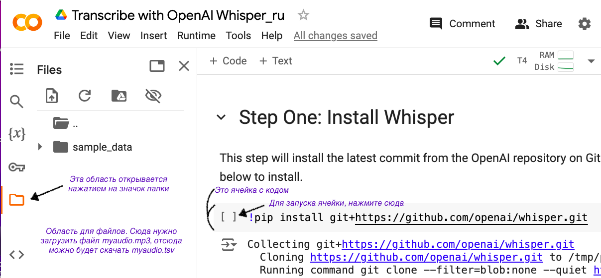

# Домашнее задание 4

Используйте то же видео с рассказом о жизни, которое вы использовали в ДЗ-3. Продолжайте работать в том же файле, при сохранении добавьте `-pos` в конец названия.

Например, ваша разметка хранится в файле `Cherepovets_pal1964.eaf` — значит, вам нужно будет открыть именно его, добавить новую разметку, сохранить под именем `Cherepovets_pal1964-pos.eaf` и загрузить на гитхаб.

*Совет:* откройте файл и сразу же через "Сохранить как..." сохраните под новым именем. Так вы точно не забудете это сделать и сможете в процессе работы сохранять через Ctrl+S, не перезаписывая старый.

## ЭДЕ

- Расшифруйте следующие 30 секунд видео
- При необходимости поправьте разметку из прошлого дз
``` 
* Название слоя - `text@aaa1970f` (на каждого говорящего по слою)
* Тип - utterance  
Обязательно заполните пункты "говорящий" (@aaa1970f) и "разметчик" (ваш никнейм латиницей).
```


## Токенизация реплик
- Для каждого говорящего создайте слой, на котором его реплики будут разбиты на слова
- Установите свойства слоя (для условного говорящего @aaa1970f):
``` 
* Название слоя `words@aaa1970f`  
* Родительский слой - text@aaa1970f  
* Тип - words  
Обязательно заполните пункты "говорящий" (@aaa1970f) и "разметчик" (ваш никнейм латиницей).
```
- Выделите слой с речью и нажмите Слой -> Токенизировать слой (Tier -> Tokenize tier). Выберите нужный слой для вставки словоформ
- Подвиньте границы слов так, чтобы они совпадали с произношением
- Не забудьте проверить, что реплики правильно поделились на токены (проверяйте по [Грамматическому словарю Зализняка](https://gramdict.ru/).
```
  какой-то, где-нибудь, что-либо - 1 токен
  большой-большой - 3 токена
  наконец-то - 3 токена
  темным-темно - 1 токен
  кое в каком - 3 токена
  в течение - 2 токена (в - предлог, течение - существительное)
  местоимения с кое-, -то, -либо, -нибудь - 1 токен
  слова с -то, ка, -с (ты-то, Маша-то, давай-ка, сударь-с) - 1 токен
  светло-коричневый (серо-буро-красно-...-фиолетовый) - 1 токен
  Ростов-на-Дону - 5 токенов (Ростов, -, на, -, Дону)
  девушка-менеджер - 3 токена (потому что изменяются обе части: увидел девушку-менеджера)
  генерал-майор - 1 токен
    1) Потому что первая часть не изменяется.
    2) Если девушка-менеджер - и девушка, и менеджер, то генерал-майор - не майор.
  диван-кровать - спорный случай: если первая часть изменяется - 3 токена, если не изменяется - скорее 1 токен
  бывают необычное членение на токены в старой орфографии (не смотря на), в соц. сетях, в дневниковых записях

Общее: слова, написанные через пробел - не одно слово. Дефис может делить на несколько слов.

```

## Грамматическая разметка
- Из [шаблона](https://github.com/olesar/lingdata/blob/gh-pages/data/elan_livecorpus_template.eaf) импортируйте слой (Слой -> Импортировать слой / Tier -> Import Tier) с POS-разметкой. Именно слой, а не тип!
- Переименуйте его в формате `pos@aaa1970f` и перепривяжите к слою `words...` одного из говорящих. (Слой -> Изменить… / Tier -> Change Tier Attributes)
- Слой -> Создать аннотации на зависимых слоях… (Tier -> Create Annotations on Dependent Tiers) -> выбрать слой-источник -> Next -> выбрать конечный слой. В слое POS должны появиться пустые аннотации. Выберите часть речи из открывающегося списка, double-кликая на каждой аннотации

Значение тегов можно посмотреть на сайте проекта [Universal dependencies](https://universaldependencies.org/ru/pos/index.html). При определении части речи вам могут помочь [НКРЯ](https://ruscorpora.ru/search?search=CgQyAggBMAE%3D) и [Грамматический словарь Зализняка](https://gramdict.ru/), хотя там частеречные теги записываются не так, как в нашем проекте.
- Знакам пунктуации (`/`, `!`, `?`) нужно присвоить метку PUNCT. Для этого добавьте эту метку в контролируемый словарь. (Правка > Редактировать списки значений) (Edit > Edit Controlled Vocabularies) Выберите нужный список (POS), добавьте PUNCT в значение и punctuation в описание элемента.
- Проверьте, что у вас есть метка PARENTH для вводных слов. Если нет, добавьте.

#### Частые вопросы:
```
- Как размечать обрывы?
- Если восстанавливается слово, указываем часть речи слова.
Если вы не понимаете, что это за слово, пишите X.
"плани= планировали" - VERB, VERB; "пр= планировали" - X, VERB

- Что делать, если имена собственные делятся на несколько слов?
- Делить на слова и размечать по отдельности. "приморский край" - ADJ, NOUN

- Что делать с вводными конструкциями в несколько слов?
- Делить на слова и размечать каждое слово отдельно. "тем не менее" - PRON, PART, ADV
```

## Бонусное задание
*Идеально выполненное домашнее задание оценивается в 8 баллов. Бонусное задание не является обязательным и позволяет получить 9-10 баллов, если основная часть выполнена на 8. Выполнение бонусного задания требует много времени. Ассистенты не консультируют по поводу бонусных заданий.*

ASR - Automatic Speech Recognition

Распознайте аудио любой доступной вам нейросетью и импортируйте распознанный текст в .eaf файл отдельным слоем `asr@aaa1970f`. Чтобы импортировать слой автоматически, необходимо, чтобы нейросеть возвращала не только распознанный текст, но и таймкоды реплик.

> Один из вариантов выполнения задания:
> - Сохраните звук из вашего видео в файл `myaudio.mp3`
> - Распознайте речь с помощью нейросети Whisper ([готовый код](https://colab.research.google.com/drive/1DtZM_BE6Z2tdeQB8lgmhNSL5dLjk4w8b?usp=sharing))
>   - войдите в гуглаккаунт
>   - откройте в *колабе* файл с кодом по ссылке: сверху Open with ... > Google Colab (если вы раньше не пользовались колабом, его можно установить из доступных приложений)
>   - загрузите в область для файлов ваше аудио `myaudio.mp3`
>   - запустите по очереди все ячейки с кодом: у ячейки, закончившей свою работу, появляется зелёная галочка
>   - в области с файлами появился файл `myaudio.tsv` с таймкодами и репликами, скачайте его (три точки у файла > Download)
> - Импортируйте текст в ELAN: Файл > Импортировать > Текст CSV / Текст с разделителями > выберите файл > укажите разделитель, тип информации для каждой колонки и первую строку с данными
> - Назовите слой правильно

Открытый в Google Colab файл выглядит так


- Создайте в папке `livecorpus` файл asr.md.
- Напишите, каким способом вы делали ASR. Если воспользовались тем, что описан выше, напишите "По инструкции из дз".
- Письменно проанализируйте минуту распознавания, которой вы занимались в этом дз. В каких местах возникли ошибки и неточности? Понимаете ли, почему именно эти места вызвали сложности?
