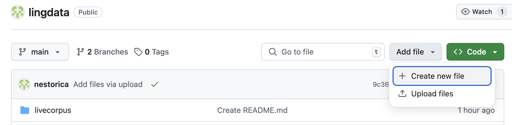

### Первый практикум. Организация курса. GitHub. Личная страничка с использованием HTML    

* Знакомимся

* О структуре курса

* GitHub

* Личная страничка  


### Основы работы с GitHub

На занятиях по Python вы научитесь полноценно пользоваться GitHub как системой контроля версий. Для выполнения заданий в классе и домашнего задания достаточно, чтобы вы  

* завели аккаунт на GitHub  

* сделали форк (копию) репозитория [lingdata](https://github.com/nestorica/lingdata)  

* загрузили файлы в репозиторий  

Все эти действия можно совершать с помощью браузера, особенно если вы не знаете заклинаний `git add`, `git commit`, `git push` в командной строке.  


#### 1. Создаем аккаунт на GitHub

На странице [github.com](https://github.com/) нажмите Sing Up, заведите аккаунт (имя - любое), подтвердите его по электронной почте.


Возможно, вам предложат пройти дополнительные тесты, чтобы убедиться, что вы не робот:


#### 2. Копируем репозиторий lingdata  

Убедитесь, что вы залогинены на гитхабе. Откройте страницу по ссылке (https://github.com/nestorica/lingdata) и нажмите кнопку `fork`. В результате в вашем аккаунте появится копия этого репозитория, с которой вы дальше будете работать. (Пожалуйста, не меняйте имя репозитория `lingdata` и его статуса Public, чтобы мы могли автоматически проверять ваши задания.)   


#### 3. Работаем с _вашим_ репозиторием lingdata  

В репозиторий можно зайти по ссылке вида `https://github.com/<your-account>/lingdata` (иными словами, вместо nestorica впишите ваше имя пользователя).  

1. Структура файлов

Чтобы увидеть структуру файлов, нажмите на **Code** в левом верхнем углу. 


2. История изменений

GitHub является системой контроля версий. С помощью коммитов (commit - команда обновления содержания репозитория) фиксируются с привязкой ко времени все изменения в файлах, произошедшие с прошлого коммита. Это дает возможность работать с кодом нескольким разработчикам, отменять коммиты, анализировать активность разработки проекта. На GitHub можно посмотреть историю изменения файла, сравнить версии файлов в разных коммитах, посмотреть на историю изменений в вашем аккаунте в целом (в открытых репозиториях).   


3. Ветки репозитория

Ветки (branch) - это способ параллельной работы с репозиторием, когда разные разработчики вносят изменения (делают коммиты) в разные версии репозитория. В ветках может быть разный состав файлов. Например, у проекта может быть основная ветка, предлагаемая как релиз проекта для пользователей, и другая для текущей разработки. В какой-то момент такие ветки могут объединить (смерджить версии в единую, автоматически или вручную), а потом снова начать развивать ветки независимо.  


Сейчас у нашего репозитория есть две ветки - `main` и `gh-pages`. Одна из веток, `main`, дефолтная - это значит, что она открывается в браузере по умолчанию и вы по умолчанию вносите изменения в нее. Вторая ветка -- для GitHub pages, сервиса, который позволяет представлять содержание репозитория как сайта.  

  

В новой вкладке откройте ссылку [https://nestorica.github.io/lingdata/], чтобы увидеть страницу, представляющую содержание файла README.md в корне репозитория.  


4. Создайте новый файл

   с помощью кнопки `Add files` > `+ Create new file` создайте файл и назовите его `test.txt`.

  
  
Напишите в нем любой текст и сохраните изменения -- `Commit changes...` (зеленая кнопка). При коммите полезно описывать в специальном поле, какие изменения вы внесли и почему.  

  

Проверьте, что изменилось в структуре репозитория и в истории изменений.  


5. Отредактируйте существующий файл

Кликните на файл `test.txt`. Кликните на "карандашик" справа вверху. Измените текст. Снова сохраните изменения -- Commit!


6. Чтобы создать папку внутри репозитория

  нажмите `Create file` и создайте файл с именем `newfolder/readme.txt` или `newfolder/readme.md`, где `newfolder` - имя вашей папки. В файл readme рекомендуется написать краткий комментарий, для чего эта папка. Сохраните изменения.  


7. Кнопка `Raw`

Когда вы кликаете на файл, то открывается страница GitHub со всеми кнопками и сервисами, позволяющими работать с этим файлом. Кнопка `Raw` позволяет увидеть файл в "сыром" текстовом виде (со всеми тегами разметки, если они есть).  


8. Удаление файла

На странице файла, нажмите три точки справа от имени файла, а затем красную ссылку `Delete file`. Удаление всех файлов в папке удалит и саму папку.  

Удалите последний созданный файл. (Но его содержание и история операций с ним будут доступны через историю изменений).  


#### 4. Markdown   

Markdown (md) - это облегченный язык для разметки форматирования текстов. Он часто используется для написания документации на GitHub. 

Самое основное   

```markdown

# Заголовок 1
## Заголовок 2
### Заголовок 3

* ненумерованный
* список
  * элементы второго уровня
  * элементы второго уровня

1. нумерованный 
2. список

**Bold** и _Italic_ и `ключевые слова`

[Link](url) and 

Три обратных апострофа  (```) выделяют и конец блока текста, обычно кода программы
```

Более подробно тут [GitHub Flavored Markdown](https://guides.github.com/features/mastering-markdown/).

Отредактируйте файл `test.txt` (см. п. 5 выше), добавив форматирование шрифта полужирным и курсивом, добавив ненумерованный список, а затем добавив ссылку.  

Вы можете переключаться между режимами `Edit` и `Preview`, чтобы увидеть визуальные эффекты форматирования.


### HTML

HTML - язык разметки форматирования веб-страниц. HTML-код работает также в файлах Markdown-а.  

Большинство тегов  html - парные, закрывающий тег содержит слэш. У тегов бывают атрибуты и значения. 

```
<html>
<body>

  <h1>Заголовок 1 уровня</h1>
  <h2>Заголовок 2 уровня</h2>
  <h3>Заголовок 3 уровня</h3>

  <p>Абзац</p>

  Принудительный перенос <br> строки (line break)

  <b>полужирный</b> и <i>курсив</i> и <i><u>подчеркнутый</u> курсив</i>

    с помощью CSS стилей в <span style="font-weight:bold; color:blue;">тексте</span>. 

  <a href="github.com">гиперссылка</a>

  картинка</a>

</body>
</html>
```


### Дополнительные материалы

##### Как создать репозиторий GitHub "с нуля" 


Если так не получилось, зайдите на основную страницу своего гитхаба (например, моя - https://github.com/olesar, где olesar - название моего аккаунта) и нажмите кнопку New на вкладке Repositories


3. Укажите имя репозитория, тип (Public) и добавьте файл README.


