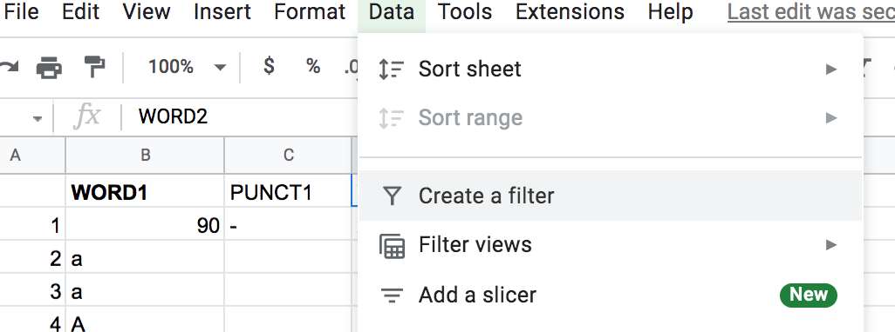
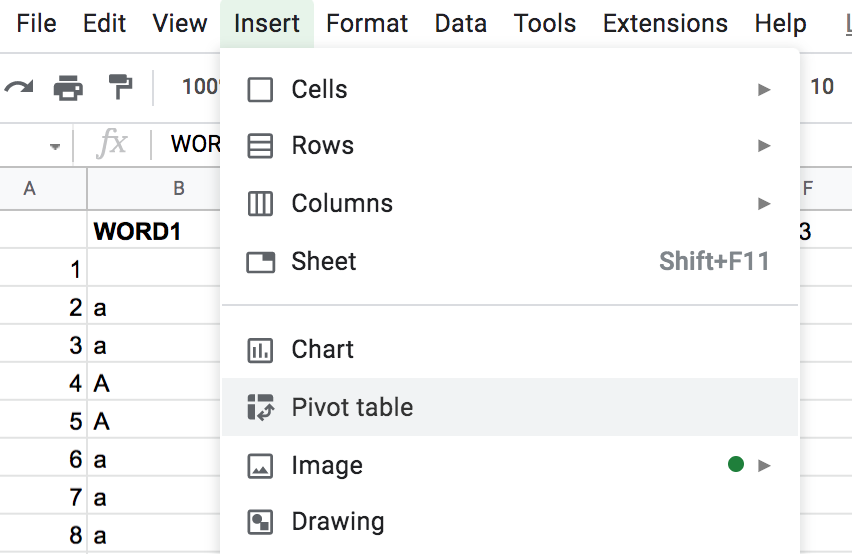
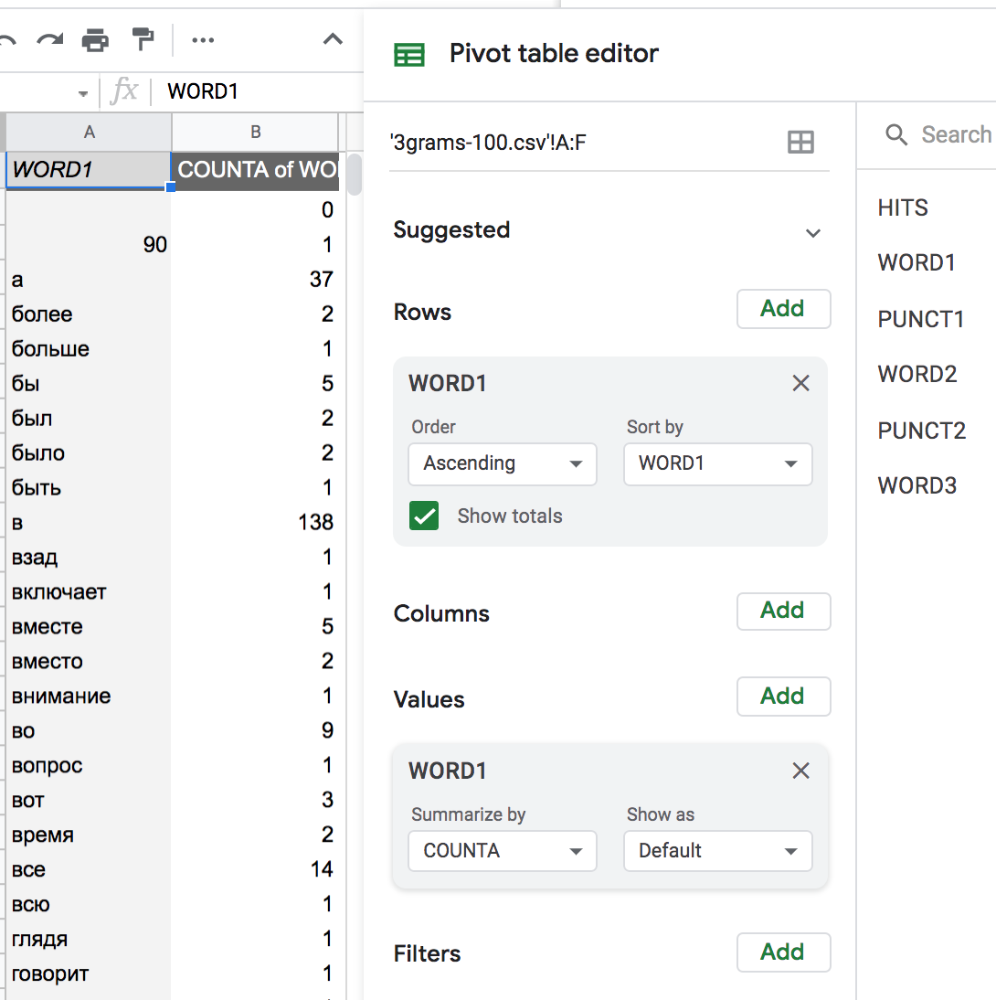

### Обработка лингвистических данных в табличном редакторе 
##### Фильтры, сводные таблицы, сортировки, текстовые формулы

Для работы нам понадобятся (Google Таблицы)[https://docs.google.com/spreadsheets]  или Excel, OpenOffice, LibreOffice и др. табличные редакторы.  

#### Файл для работы  
Скачайте выдачу из НКРЯ, Araneum или других корпусов. Скачайте таблицу самых частотных n-грам корпуса.
Можно взять для работы готовую таблицу выдачи конструкции типа "Человек человеку друг..." [отсюда](https://docs.google.com/spreadsheets/d/1WIUaz2zORr-Cm2R1qVUSNpqdgxcVq1bNl-5Lx0-ltIY/edit?usp=sharing) или таблицу N-грамм [отсюда](https://docs.google.com/spreadsheets/d/1nRaY1rKdbQXDmtiGbYAWqfz0y4N8HMTxthth8iv9N4w/edit?usp=sharing) - сохраните себе их копию.

#### Темы практикума  
* Сортировки  
* Фильтры  
* Сводные таблицы  
* Как работают формулы  
* Другие полезные вещи  

**Начало работы**
Создайте новый лист (spreadsheet) и сделайте копию вашей таблицы. Это можно сделать, щёлкнув по названию листа правой кнопкой (или кликнув левой кнопкой мыши по стрелке рядом с названием листа) и выбрав пункт «Создать копию» (там же можно его переименовать). Другой способ — создать новый лист и скопировать содержание ячеек с другого листа (в этом случае форматы ширины и высоты ячеек могут измениться).  
Вставьте пустую строку в начало листа и озаглавьте все колонки.  
Потренируйте основные навыки работы с таблицами (см. ниже).  

**Сортировка**: 
отсортируем таблицу по первому столбцу n-грамма, по последнему, по второму и третьему вместе.

**Фильтры**: 
Установим режим фильтров (в панели над таблицей — значок справа, похожий на воронку).   

Обратите внимание: выделилась область, с которой будет работать фильтр (тонкая зелёная граница по краю), а текст в первой строке таблицы выделился полужирным шрифтом. В верхней ячейке столбца со вторым словом n-грама щелкнем по стрелке вниз и выберем "Фильтровать по условию".   
Фильтры с текстовым условием: 
  * текст содержит..., 
  * текст не содержит..., 
  * начинается с..., 
  * заканчивается на..., 
  * текст в точности…   
Фильтры на несколько столбцов.

**Сводные таблицы**:
Сводные таблицы позволяют составлять списки уникальных элементов в столбце, получать статистику по ним, а также получать таблицы сопряженности (статистики совместной встречаемости) для некольких столбцов.  

Выделите нужные столбцы (у них обязательно должны быть заголовки),   
создайте заготовку для сводной таблицы в отдельной вкладке  
и отметьте столбцы - источник информации в окнах Ряд и Значение (можно перетащить туда название столбцов или кликнуть Добавить ряд...).

Значение: Количество (COUNTA) по тому же столбцу, который указан в Ряде - сколько раз встретилось данное значение ячейки (например, предлог "в") в столбце.  
Значение: Сумма (SUM) по другому столбцу с числовыми данными (например, по частоте встречаемости) - покажет общую частоту встречаемости для данной единицы (например, предлога "в").

Добавив несколько столбцов в Ряд, можно получить вложенные сводные таблицы.  
Указав (другой) столбец исходной таблицы в окне Столбец, можно получить таблицу сопряженности.

[подробные инструкции со скриншотами](https://github.com/lizaku/Programming-and-computer-instruments/wiki/%D0%A1%D0%B5%D0%BC%D0%B8%D0%BD%D0%B0%D1%80-12:-%D1%82%D0%B0%D0%B1%D0%BB%D0%B8%D1%86%D1%8B-(%D1%87%D0%B0%D1%81%D1%82%D1%8C-2))  

**Формулы для работы с текстом**: 
* для того, чтобы объединить слова n-грама друг с другом, используйте оператор конкатенации ("склеивания" строк) — амперсанд &. Оставьте между словами пробел. 
* длина строки: =ДЛСТР/LEN(строка),  
* правая часть строки: =ПРАВСИМВ/RIGHT(строка; количество символов),  
* левая часть строки: =ЛЕВСИМВ/LEFT(строка; количество символов),  
** вырезать какую-то часть строки с символа на позиции X до символа на позиции Y: ПСТР/MID(строка; X; Y). (C помощью формул MID и LEN можно отсортировать строку по алфавиту с конца ("перевернуть" наоборот).)   
Если при создании или копировании формулы у вас сбилась адресация — посмотрите информацию про относительные и абсолютные ссылки на странице [Основная информация по Google Таблицам](https://github.com/ElizavetaKuzmenko/Programming-and-computer-instruments/blob/master/Google-Spreadsheets-basic.md).  
Будьте аккуратны при копировании и замене с фильтрами!

**Работа с диаграммами**:   
Отфильтруйте те n-граммы, между элементами которых нет знаков препинания. Вставьте отфильтрованные результаты "как текст, сохраняя только значения ячеек, затем найдите сверху меню "Вставка" — "Диаграммы". В открывшемся окне выбрать диапазон и тип диаграммы.

**Разобьём текст по столбцам**: 
Кликните по ячейке рядом с первой строчкой со словами и воспользуйтесь формулой SPLIT(текст; разделитель), где ваш разделитель — это пробел. «Растяните» формулу на всю таблицу.

#### Дополнительно
Основные операции в таблицах, которые полезно освоить:
* выделить весь столбец  
* выделить всю строку  
* выделить всё (клик на самый верхний левый квадратик таблицы)  
* вставка новых и удаление существующих строк и столбцов  
* вставка новых листов (worksheet) в рабочий файл и удаление существующих листов  
* вставка формул (умеете ли вы перенумеровать 20 ячеек в столбце от 1 до 20 с помощью формул?)  
* копирование и вставка из одной ячейки в другие   

Не знаете, как сделать что-то из этого? Посмотрите подробные инструкции на странице [Основная информация по Google Таблицам](https://github.com/ElizavetaKuzmenko/Programming-and-computer-instruments/blob/master/Google-Spreadsheets-basic.md).

Полезно знать: "горячие" клавиши  
`F2` - редактировать текст или формулу в ячейке  
`Ctrl + C` (копировать), `Ctrl + V` (вставить)  
`Ctrl + End` (`Ctrl + Fn + End`) - переместиться в нижний правый угол таблицы  
`Ctrl + Home` (`Ctrl + Fn + Home`) - переместиться в правый левый угол таблицы  
`Shift + Ctrl + End` (Shift +..) - выделить область от текущей ячейки до нижнего правого края таблицы  
`Shift + Ctrl + Home` (Shift +..) - выделить область от текущей ячейки до начала таблицы  

В конце работы укажите ссылку на гугл-док, с которым вы работали, [здесь](https://docs.google.com/forms/d/e/1FAIpQLSfHCLaXSXy1xTra_AIaIkwqT6T9xapoly9bbo7_b2NkWmt7lw/viewform).

Справка по Google Таблицам
https://support.google.com/docs#topic=2811806
