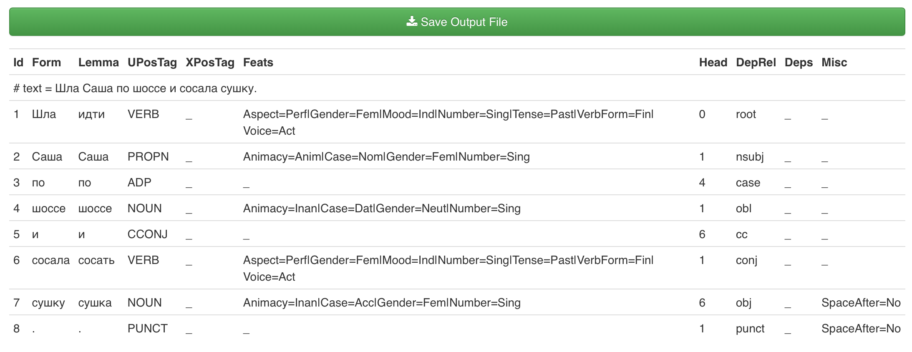

### Разметка лексико-грамматической информации: леммы, части речи, грамматические категории, синтаксические связи    

Данные для работы: ваши расшифровки в *.eaf и *.textgrid.txt форматах.  

#### 1. Автоматическая морфологическая и синтаксическая разметка в UDpipe   
* [http://lindat.mff.cuni.cz/services/udpipe](http://lindat.mff.cuni.cz/services/udpipe/) - мультиязычный инструмент разметки, обученный на корпусах Universal Dpendencies для разных языков    
* Модель - Russian SynTagRus   
* Tag & Lemmatize - ставит метки частей речи, значений грамматических категорий и лемм  
* Parse - делает разметку синтаксических зависимостей (указывает синтаксического хозяина и тип связи)      
* Режимы (Advanced Options):
 * plain text  
 * vertical  
 * conll-u (10 позиций, разделенных табуляцией)  
* Морфологическую разметку удобно просматривать в Table View, синтаксическую - в виде дерева (Tree View)   

#### 2. Разметка транскрипта  
##### 2.1 Токенизация      
В ELAN разбейте реплики на токены  
* Для токенов вам понадобится слой вида @aaa2000f-words c типом words. Не забудьте указать для него родительский слой (@aaa2000f-text) и код говорящего (@aaa2000f).  
* Токенизируйте каждый слой c репликами (Слой - Разбить слой на слова).   
По умолчанию, при токенизации корректно обрабатываются только точки и запятые, поэтому в поле "знаки препинания" укажите те знаки, которые в вашем транскрипте нужно выделить как отдельные токены, например, `/?!")(`   
Отдельные целые токены образуют пометы вида `#смех#`, `[нрзб]` и обрывки слов вида `к...`, эти знаки препинания указывать не нужно.  
* В нашей версии разметки временные коды границ токенов ставятся условно (т.е. подгонять их под реальное звучание не нужно).  
* Экспортируйте слои с токенами (только!) в файл moscow.tokens.csv, поля для экспорта:
  * название слоя  
  * метка говорящего (оставьте пустым соответствующий чекбокс)  
  * время начала (в формате сс.мс)  
  * время окончания (в формате сс.мс)  
  * токен  
* Откройте файл в текстовом редакторе и проверьте, что токены выделены правильно. Если есть ошибки, вернитесь в ELAN, исправьте реплики (например, отделите "приклеившиеся" символы пробелами) и сделайте токенизацию снова.  
  
##### 2.2 Перевод в формат conll-u    
(с помощью текстового редактора и редактора таблиц)  
В файле \*.tokens.csv сейчас находятся пять столбцов с разделителем-табуляцией. Поменяйте порядок и количество столбцов так, чтобы во втором оказались словоформы, а вся остальная информация - в последнем (по стандарту conll-u, в нем может храниться любая информация, прежде всего, полезная для совместимости разных форматов). В первый нужно поставить нумерацию строк, остальные столбцы заполнить нижними прочерками.   
* Найти `^(.+)\t(.+)\t(.+)\t(.+)\t(.+)$` -- так мы найдем пять подстрок, разделенных табуляцией  
* Заменить `\t\5\t_\t_\t_\t_\t_\t_\t_\t\1#\2#\3#\4` -- поменяем столбцы местами, в последнем столбце содержимое четырех полей разделим символом решетки.   
* Пронумеровать строки   
В некоторых текстовых редакторах есть опция последовательной нумерации строк, иногда она устанавливается в виде дополнительного пакета (например, в Atom). Для простоты, проставим номера строк в табличном редакторе.  
В итоге мы должны получить такой файл: 

##### 2.3 Разметка в UDpipe 
Используя модель Russian SynTagRus, разметьте данные в UDpipe (режим ввода conll-u, Tag & Lemmatize).  
* Сохраните разметку в текстовый файл, переименуйте в moscow.conllu (где moscow - условное название вашего видеофайла).   

#### 3. Проверка разметки  
(в NotePad++ или Excel/таблицах, по выбору)

ID | Word | Lemma | POS | (Extra) | Features | HeadPosition | Relation | _ | (EverythingElse)
---|---|---|---|---|---|---|---|---|---|
1 | Эээ | эээ | INTJ | _ | _ | _ | _ | _ | @aaa1980f-words#@aaa1980f#109.9#110.241
2 | ра... | ра... | X | _ | _ | _ | _ | _ | @aaa1980f-words#@aaa1980f#110.241#110.582
3 | / | / | PUNCT | _ | _ | _ | _ | _ | @aaa1980f-words#@aaa1980f#110.582#110.923
4 | Ку... | куда | ADV | _ | Degree=Pos | _ | _ | _ | @aaa1980f-words#@aaa1980f#110.923#111.264
5 | куда | куда | ADV | _ | Degree=Pos | _ | _ | _ | @aaa1980f-words#@aaa1980f#111.264#111.605
6 | вы | вы | PRON | _ | Case=Nom|Number=Plur|Person=2 | _ | _ | _ | @aaa1980f-words#@aaa1980f#111.605#111.946
7 | удалились | удалиться | VERB | _ | Aspect=Perf|Mood=Ind|Number=Plur|Tense=Past|VerbForm=Fin|Voice=Mid | _ | _ | _ | @aaa1980f-words#@aaa1980f#111.946#112.287
8 | ? | ? | PUNCT | _ | _ | _ | _ | _ | @aaa1980f-words#@aaa1980f#112.287#112.628

Проверьте, что у вас правильно определены 
* леммы - столбец 3  
* части речи -- столбец 4  
* значения грамматических категорий -- столбец 6  

##### 3.1 Схема разметки UD-Russian  
Мы будем пользоваться схемой разметки Universal Dependencies для русского языка.  
* [https://universaldependencies.org/u/pos/all.html](https://universaldependencies.org/u/pos/all.html) - метки частей речи  
* [https://universaldependencies.org/u/feat/all.html](https://universaldependencies.org/u/feat/all.html) - метки грамматических помет  
* [https://universaldependencies.org/u/dep/all.html](https://universaldependencies.org/u/dep/all.html) - метки синтаксических связей  

##### 3.2 Не-слова  
Не-словами считаются:  
* Обрывки слов, которые невозможно восстановить и интерпретировать  
* Пометы в решетках типа #смех#  
* Таймкоды (по идее, в вашей разметке их не должно быть в столбце словоформ, они должны попасть в столбец 10)  
* Слова на иностранных языках  
У этих слов лемма совпадает со словоформой (но записывается со строчной буквы и без многоточий), часть речи - X, в грамматических признаках ставится нижнее подчеркивание `_`, см. пример выше.  

##### 3.3 Лемматизация  
Исправьте леммы (3-й столбец) там, где это нужно.  
* Глаголы - у глаголов ставится лемма того вида, в котором он стоит (ср. _подписать_ - несов. вид, _писать_, _подписывать_ - сов. вид)  
* Имена собственные - лемма у имен собственных пишется с заглавной буквы, у всех остальных слов - с прописной    
* Имена - лемма ставится во множественном числе только у слов pluralia tantum (ср. _известия_ - _известие_, но _макароны_ - _макароны_)  
* Междометия, маркеры хезитации - лемма совпадает со словоформой, но не содержит многоточий, если у междометия есть "словарная" форма, приводим к ней (ср. _эээ - эээ_, _значит - значит_, нууу... - ну)  
* Обрывки слов - восстанавливаются, если это возможно (т. е. для _позна... познакомились_ - лемма _познакомились_ указывается оба раза). Если непонятно, что говорящий хотел сказать, мы считаем это не-словами.  

##### 3.4 Части речи  
В отличие от схемы разметки, принятой в НКРЯ, в UD различаются имена собственные и нарицательные, сочинительные и подчинительные союзы, порядковые числительные считаются прилагательными. 
Предлог обозначается как ADP, местоимение-существительное как PRON, а местоимение-прилагательное - как DET.  

##### 3.5 Грамматические признаки    
Если ошибки в части речи нет, задача обычно сводится к проверке значений грамматических категорий. Обращайте особое внимание на падеж и число, а также грамматический род.  
Если вы исправили помету части речи, то набор грамматических категорий может измениться. Скопируйте разметку из другого разбора и исправьте пометы признаков грамматических категорий. Если слов нужной части речи в файле нет, постарайтесь получить нужный разбор с помощью UDpipe, подавая ему на разбор более частотные и более "типичные" слова нужной части речи.  

#### Дополнительно 
* Инструменты для просмотра и правки синтаксической разметки  
  * [https://arborator.ilpga.fr/q.cgi](https://arborator.ilpga.fr/q.cgi)  
  * [UD-annotatrix](https://universaldependencies.org/tools.html#ud-annotatrix) и другие инструменты для работы с conll-u форматом
