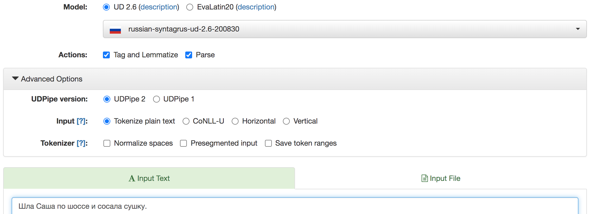

### Разметка лексико-грамматической информации: леммы, части речи, грамматические категории, синтаксические связи    

[UDPipe](http://lindat.mff.cuni.cz/services/udpipe/) - мультиязычный инструмент разметки, обученный на корпусах Universal Dpendencies для разных языков.    
Он может размечать как обычные текстовые файлы, так и посрочное представление токенов в формате с разделителями-табуляцией (conllu).  

Данные для работы: Файл в формате plain text для разметки [link](data/udpipe_example.txt). Файлы [livecorpus](https://disk.yandex.ru/d/QoZPtWuZ_raV1Q), [conllu](https://disk.yandex.ru/d/KLDzEzfg454lsg) [Arborator.Grew - онлайн](https://arboratorgrew.elizia.net/?#/projects/Russian19th)      

#### 1. Автоматическая морфологическая и синтаксическая разметка в UDpipe   
  

Настройка интерфейса:  
* `Модель` - Russian SynTagRus   
* `Tag & Lemmatize` - ставит метки частей речи, значений грамматических категорий и лемм  
* `Parse` - делает разметку синтаксических зависимостей (указывает синтаксического хозяина и тип связи)      
* Режимы (Advanced Options):
 * `plain text`  
 * `vertical`  
 * `CONLL-U` (10 позиций, разделенных табуляцией)  
* Морфологическую разметку удобно просматривать в `Table View`, синтаксическую - в виде дерева (`Tree View`)   


Используя модель Russian SynTagRus, разметьте данные в UDpipe (режим ввода conll-u, Tag & Lemmatize).  
* Сохраните разметку в текстовый файл, добавив к имени файла -udpipe.conllu.  
* Сделайте копию файла, добавив к имени файла -manual.conllu.  

#### 2. Проверка разметки  
(в NotePad++ или Excel/таблицах, по выбору)

ID | Word | Lemma | POS | (Extra) | Features | HeadPosition | Relation | _ | (EverythingElse)
---|---|---|---|---|---|---|---|---|---|
1 | Эээ | эээ | INTJ | _ | _ | _ | _ | _ | words@aaa1980f#@aaa1980f#109.9#110.241
2 | ра... | ра... | X | _ | _ | _ | _ | _ | words@aaa1980f#@aaa1980f#110.241#110.582
3 | / | / | PUNCT | _ | _ | _ | _ | _ | words@aaa1980f#@aaa1980f#110.582#110.923
4 | Ку... | куда | ADV | _ | Degree=Pos | _ | _ | _ | words@aaa1980f#@aaa1980f#110.923#111.264
5 | куда | куда | ADV | _ | Degree=Pos | _ | _ | _ | words@aaa1980f#@aaa1980f#111.264#111.605
6 | вы | вы | PRON | _ | Case=Nom\|Number=Plur\|Person=2 | _ | _ | _ | words@aaa1980f#@aaa1980f#111.605#111.946
7 | удалились | удалиться | VERB | _ | Aspect=Perf\|Mood=Ind\|Number=Plur\|Tense=Past\|VerbForm=Fin\|Voice=Mid | _ | _ | _ | words@aaa1980f#@aaa1980f#111.946#112.287
8 | ? | ? | PUNCT | _ | _ | _ | _ | _ | words@aaa1980f#@aaa1980f#112.287#112.628

Проверьте, что у вас правильно определены 
* леммы - столбец 3  
* части речи -- столбец 4  
* значения грамматических категорий -- столбец 6  

##### 3.1 Схема разметки UD-Russian  
Мы будем пользоваться схемой разметки Universal Dependencies для русского языка.  
* [https://universaldependencies.org/u/pos/all.html](https://universaldependencies.org/u/pos/all.html) - метки частей речи  
* [https://universaldependencies.org/u/feat/all.html](https://universaldependencies.org/u/feat/all.html) - метки грамматических помет  

##### 3.2 Не-слова  
Не-словами считаются:  
* Обрывки слов, которые невозможно восстановить и интерпретировать  
* Пометы в решетках типа #смех#  
* Таймкоды (по идее, в вашей разметке их не должно быть в столбце словоформ, они должны попасть в столбец 10)  
* Слова на иностранных языках  
У этих слов лемма совпадает со словоформой (но записывается со строчной буквы и без многоточий), часть речи - `X`, в грамматических признаках ставится нижнее подчеркивание `_`, см. пример выше.  

##### 3.3 Лемматизация  
Исправьте леммы (3-й столбец) там, где это нужно.  
* Глаголы - у глаголов ставится лемма того вида, в котором он стоит (ср. _подписать_ - сов. вид, _писать_, _подписывать_ - несов. вид)  
* Имена собственные - лемма у имен собственных пишется с заглавной буквы, у всех остальных слов - с прописной    
* Имена - лемма ставится во множественном числе только у слов pluralia tantum (ср. _известия_ - _известие_, но _макароны_ - _макароны_)  
* Междометия, маркеры хезитации - лемма совпадает со словоформой, но не содержит многоточий, если у междометия есть "словарная" форма, приводим к ней (ср. _эээ - эээ_, _значит - значит_, _нууу_ - ну)  
* Обрывки слов - восстанавливаются, если это возможно (т. е. для _позна... познакомились_ - лемма _познакомились_ указывается оба раза). Если непонятно, что говорящий хотел сказать, мы считаем это не-словами.   

##### 3.4 Части речи  
В отличие от схемы разметки, принятой в Национальном корпусе русского языка, в UD различаются имена собственные и нарицательные (NOUN и PROPN), сочинительные и подчинительные союзы (CCONJ и SCONJ), порядковые числительные считаются прилагательными (ADJ).  

Предлог обозначается как ADP, местоимение-существительное как PRON, а местоимение-прилагательное - как DET. Междометие - INTJ.   

##### 3.5 Грамматические признаки    
Всегда записываются латиницей как пара `Category=Value`.  

Если ошибки в части речи нет, задача обычно сводится к проверке значений грамматических категорий. Обращайте особое внимание на падеж и число, а также грамматический род. Особенно часто встречаются ошибки, где путаются значения падежей в совпадающих формах: `Case=Nom`, `Case=Acc`, `Case=Gen`.  

Помета (не)одушевленности ставится у имени прилагательного в винительном падеже, поскольку отличаются окончания: _знаю хороший способ_ `Animacy=Inan|Case=Acc` и _знаю хорошего врача_ `Animacy=Anim|Case=Acc`.  

Если вы исправили помету части речи, то набор грамматических категорий может измениться. Скопируйте разметку из другого разбора и исправьте пометы признаков грамматических категорий. Если слов нужной части речи в файле нет, постарайтесь получить нужный разбор с помощью UDpipe, подавая ему на разбор более частотные и более "типичные" слова нужной части речи.  

#### Ссылки  
* Поиск по корпусам UD:  
  * [UD-Taiga](http://match.grew.fr/?corpus=UD_Russian-Taiga@2.6&custom=5f8884920704c) и другие  
* Инструменты для просмотра и правки синтаксической разметки   
  * [https://arborator.ilpga.fr/q.cgi](https://arborator.ilpga.fr/q.cgi)  
  * новая версия [arboratorgrew](https://arboratorgrew.elizia.net/?#/projects/Russian19th)  
  * [UD-annotatrix](https://universaldependencies.org/tools.html#ud-annotatrix) и другие инструменты для работы с conll-u форматом
  * [https://universaldependencies.org/u/dep/all.html](https://universaldependencies.org/u/dep/all.html) - метки синтаксических отношений    


#### Дополнительные материалы   
Разметка материалов из ELAN
* Экспортируйте слои с токенами (только!) в файл вида `moscow.tokens.tsv` (где вместо moscow стоит ваша метка, т. е. то же название, что и у вашего файла .eaf).  
Поля для экспорта:  
  * название слоя  
  * метка говорящего или родительский слой (оставьте пустым соответствующий чекбокс)  
  * время начала (в формате сс.мс)  
  * время окончания (в формате сс.мс)  
  * токен  
* Откройте файл в текстовом редакторе и проверьте, что токены выделены правильно. Если есть ошибки, вернитесь в ELAN, исправьте реплики (например, отделите "приклеившиеся" символы пробелами) и сделайте токенизацию снова. Обратите внимание, что в экспортированном файле реплики идут не в том же порядке, в каком шли аннотации в ELAN-е, а рассортированы по говорящим: сначала идут все реплики одного человека, потом -- все реплики другого.  
Пример того, что мы должны увидеть в текстовом файле (значения в колонках разделены табуляцией):  
```
words@aaa1980f    @aaa1980f  109.9     110.241   Эээ 
words@aaa1980f    @aaa1980f  110.241   110.582   ра...
words@aaa1980f    @aaa1980f  110.582   110.923   /
...
```
  
**Перевод в формат conll-u**    
(с помощью текстового редактора и редактора таблиц)  

**Вариант 1 - NotePad++**
В файле \*.tokens.tsv сейчас находятся пять столбцов с разделителем-табуляцией. Поменяйте порядок и количество столбцов так, чтобы во втором оказались словоформы, а вся остальная информация - в последнем (по стандарту CONLL-U, в нем может храниться любая информация, прежде всего, полезная для совместимости разных форматов). В первый нужно поставить нумерацию строк, остальные пустые столбцы заполнить нижними прочерками.   
* Найти `^(.+)\t(.+)\t(.+)\t(.+)\t(.+)$` -- так мы найдем пять подстрок, разделенных табуляцией  
* Заменить `\t\5\t_\t_\t_\t_\t_\t_\t_\t\1#\2#\3#\4` -- поменяем столбцы местами, в последнем столбце содержимое четырех полей разделим символом решетки.   
* Пронумеровать строки от 1 до N (количества токенов в вашей разметке):  
   Правка > Генератор столбца > Числа (начать с 1, увеличить на 1, повторить 1 раз)      
(Опция последовательной нумерации строк в Atom устанавливается в виде дополнительного пакета.  
NB: в Notepad++ после этого после каждого номера появятся пробелы, их необходимо убрать через `Find&Replace`: в `Найти` ставим один пробел, поле `Заменить` оставляем полностью пустым; также проверьте, что у вас в самом конце файла нет пустой строчки, где одинокой гармонью стоит один лишь номер строки и более ничего -- такую строку надо удалить.

В итоге мы должны получить такой файл:   
```
1   Эээ    _   _   _   _   _   _   _   words@aaa1980f#@aaa1980f#109.9#110.241
2   ра...  _   _   _   _   _   _   _   words@aaa1980f#@aaa1980f#110.241#110.582
3   /      _   _   _   _   _   _   _   words@aaa1980f#@aaa1980f#110.582#110.923
...
```

**Вариант 2 - Excel или другой табличный редактор**
Поменяйте столбцы местами, как указано выше. Пустые столбцы заполните знаком нижнего подчеркивания.  
Чтоб объединить несколько столцов вместе, используйте формулу, см. [пример](https://youtu.be/nT2_JTNJhQo?t=18) и подсказку `=K1&'#"&L1&'#"&M1&'#"&N1`, как сцепить  строки из ячеек K1.. N1.   
Итоговый вид:  
  
Сохраните файл в текстовом формате с разделителями-табуляцией (tsv/csv).   

* Разметьте файл с помощью UDpipe, указав в дополнительных параметрах формат файла - conll-u.  
* Импортируйте данные в ELAN из файла с разделителями.  

